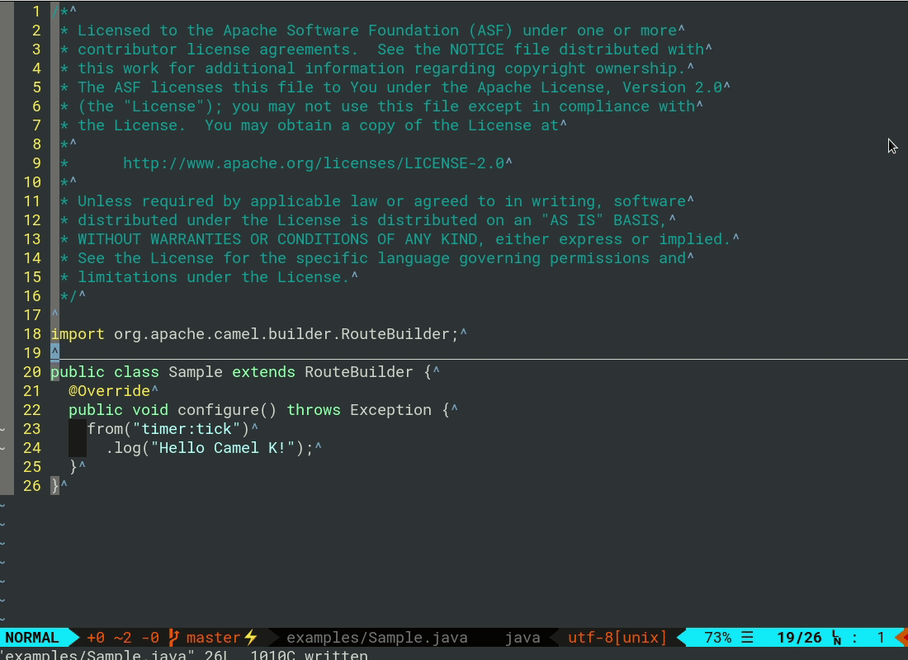
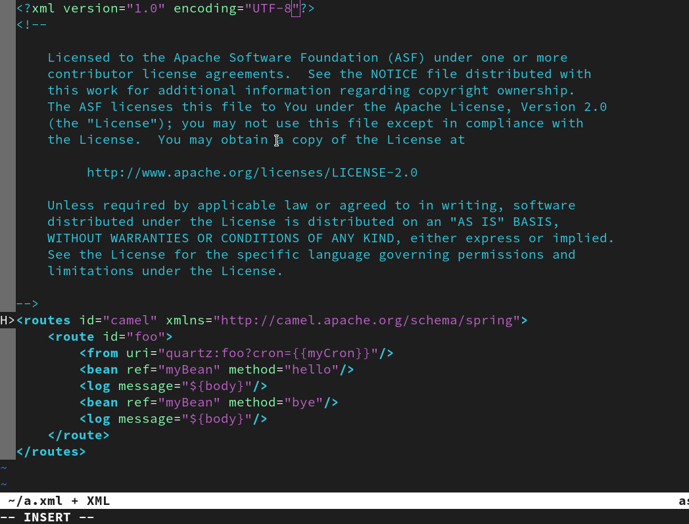

# There are 2 options which are providing the same functionalities.
-  # vim-lsp
-  # coc-vim 
Both of them can be used in Vim, Neovim or Neoclide

# Camel LSP client for Vim

This is short instructions for how to integrate your Vim editor with [Camel LSP server](https://github.com/camel-tooling/camel-language-server).






## Prerequisites

This instruction requires the following plugins:

- [vim-lsp](https://github.com/prabirshrestha/vim-lsp)
- [asyncomplete.vim](https://github.com/prabirshrestha/asyncomplete.vim)

It assumes those plugins below are already installed in `~/.vimrc`:

```vim
Plug 'prabirshrestha/asyncomplete.vim'
Plug 'prabirshrestha/async.vim'
Plug 'prabirshrestha/vim-lsp'
Plug 'prabirshrestha/asyncomplete-lsp.vim'
```

Here we use [vim-plug](https://github.com/junegunn/vim-plug) but you can use a plugin manager of your choice: pathogen.vim, Vundle, NeoBundle, dein.vim, etc.

## Download LSP jar

```sh
mkdir -p ~/lsp/camel-lsp-server
cd ~/lsp/camel-lsp-server
curl -L https://repo1.maven.org/maven2/com/github/camel-tooling/camel-lsp-server/1.5.0/camel-lsp-server-1.5.0.jar -O
```

## Install Camel LSP to your vim

Add following to `~/.vimrc`:

```vim
if executable('java') && filereadable(expand('~/lsp/camel-lsp-server/camel-lsp-server-1.5.0.jar'))
  au User lsp_setup call lsp#register_server({
    \ 'name': 'camel',
    \ 'cmd': {server_info->[
    \   'java',
    \   '-jar',
    \   expand('~/lsp/camel-lsp-server/camel-lsp-server-1.5.0.jar')
    \ ]},
    \ 'whitelist': ['java', 'xml', 'yaml']
    \ })
endif
```
To get information about the integration of Camel LS for Vim and Neovim follow this link - https://github.com/Navyashree0923/coc-camel/tree/coc